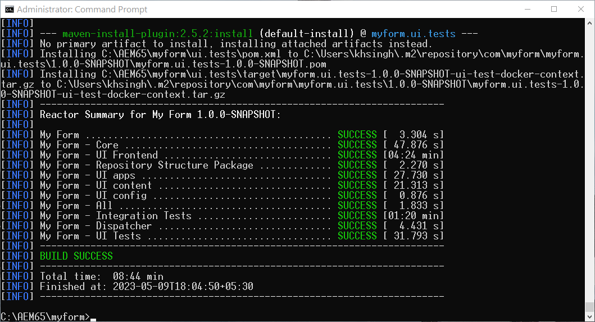

# Abilitare Headless Adaptive Forms su AEM 6.5 Forms {#enable-headless-adaptive-forms-on-aem-65-forms}

Per abilitare Headless Adaptive Forms nell’ambiente AEM 6.5 Forms, configura un progetto basato su Archetipo AEM 41 o versione successiva e implementalo in tutte le istanze di Author e Publish.

Distribuendo il progetto basato su Archetipo 41 o versioni successive di AEM nelle istanze di AEM 6.5 Forms, è possibile [creare componenti core basati su Adaptive Forms](create-a-headless-adaptive-form.md). Questi moduli sono rappresentati in formato JSON e utilizzati come Forms headful e headless adattivo, consentendo una maggiore flessibilità e personalizzazione in una serie di canali, tra cui app mobile, web e native.

## Prerequisiti {#prerequisites}

Prima di abilitare Headless Adaptive Forms nell’ambiente AEM 6.5 Forms,

* [Eseguire l&#39;aggiornamento ad AEM 6.5 Forms Service Pack 16 (6.5.16.0) o versione successiva](https://experienceleague.adobe.com/docs/experience-manager-65/release-notes/aem-forms-current-service-pack-installation-instructions.html?lang=it).

* Installa la versione più recente di [Apache Maven](https://maven.apache.org/download.cgi).

* Installa un editor di testo normale. Microsoft Visual Studio Code.

## Crea e implementa il progetto più recente basato su Archetipo AEM

Per creare un progetto basato su Archetipo AEM 41 o [versione successiva](https://github.com/adobe/aem-project-archetype) e distribuirlo a tutte le istanze di authoring e pubblicazione:

1. Accedi al computer, hosting ed esecuzione dell’istanza Forms di AEM 6.5, come amministratore.
1. Apri il prompt dei comandi o il terminale.
1. Esegui il seguente comando per creare un progetto basato su Archetipo 41 di AEM:

   * Microsoft Windows

   ```Shell
      mvn -B org.apache.maven.plugins:maven-archetype-plugin:3.2.1:generate ^
      -D archetypeGroupId=com.adobe.aem ^
      -D archetypeArtifactId=aem-project-archetype ^
      -D archetypeVersion=41 ^
      -D appTitle="My Form" ^
      -D appId="myform" ^
      -D groupId="com.myform" ^
      -D includeFormsenrollment="y" ^
      -D aemVersion="6.5.23" 
   ```

   * Linux o Apple macOS

   ```Shell
      mvn -B org.apache.maven.plugins:maven-archetype-plugin:3.2.1:generate \
      -D archetypeGroupId=com.adobe.aem \
      -D archetypeArtifactId=aem-project-archetype \
      -D archetypeVersion=41 \
      -D appTitle="My Form" \
      -D appId="myform" \
      -D groupId="com.myform" \
      -D includeFormsenrollment="y" \
      -D aemVersion="6.5.23" 
   ```

   Quando esegui il comando di cui sopra, tieni presente quanto segue:

   * Aggiorna il comando in modo che rifletta i valori specifici per l&#39;ambiente, inclusi appTitle, appId e groupId. Impostare inoltre i valori di includeFormsenrollment su &#39;y&#39;. Se si utilizza Forms Portal, impostare l&#39;opzione _includeExamples=y_ per includere nel progetto i componenti core di Forms Portal.


1. (Solo per progetti basati su Archetipo versione 41) Dopo la creazione del progetto Archetipo AEM, abilita i temi per Forms adattivo basato su Componenti core. Per abilitare i temi:

   1. Apri la [cartella dei progetti Archetipo AEM]/ui.apps/src/main/content/jcr_root/apps/__appId__/components/adaptiveForm/page/customheaderlibs.html per modificare:

   1. Aggiungere il seguente codice alla riga 21:

      ```XML
      <sly data-sly-use.clientlib="core/wcm/components/commons/v1/templates/clientlib.html"
      data-sly-use.formstructparser="com.adobe.cq.forms.core.components.models.form.FormStructureParser"
      data-sly-test.themeClientLibRef="${formstructparser.themeClientLibRefFromFormContainer}">
      <sly data-sly-test="${themeClientLibRef}" data-sly-call="${clientlib.css @ categories=themeClientLibRef}"/>
      </sly>
      ```

      

   1. Salva e chiudi il file.

1. Aggiorna il progetto per includere la versione più recente dei Componenti core di Forms:

   1. Apri la [cartella dei progetti Archetipo AEM]/pom.xml per la modifica.
   1. Imposta la versione di `core.forms.components.version` e `core.forms.components.af.version` sulla [versione più recente dei componenti core di Forms](https://github.com/adobe/aem-core-forms-components/tree/release/650).

   1. Salva e chiudi il file.


1. Dopo aver creato correttamente il progetto Archetipo AEM, crea il pacchetto di distribuzione per il tuo ambiente. Per generare il pacchetto:

   1. Passa alla directory principale del progetto Archetipo AEM.


   1. Esegui il seguente comando per generare il progetto Archetipo AEM per il tuo ambiente:

      ```Shell
      mvn clean install
      ```

      


   Una volta generato correttamente il progetto Archetipo AEM, viene generato un pacchetto AEM. Puoi trovare il pacchetto nella [cartella dei progetti Archetipo AEM]\all\target\[appid].all-[versione].zip

1. Utilizza [Gestione pacchetti](https://experienceleague.adobe.com/docs/experience-manager-65/administering/contentmanagement/package-manager.html?lang=it) per distribuire il pacchetto [Cartella di progetto Archetipo AEM]\all\target\[appid].all-[versione].zip in tutte le istanze di authoring e pubblicazione.

>[!NOTE]
>
>
>
>Se si verificano problemi durante l&#39;accesso alla finestra di dialogo di accesso in un&#39;istanza di pubblicazione per installare il pacchetto tramite Gestione pacchetti, provare ad accedere tramite il seguente URL: http://[URL server di pubblicazione]:[PORT]/system/console. Questo ti consente di accedere all’istanza Publish e di procedere con il processo di installazione.


I Componenti core sono abilitati per il tuo ambiente. Nell&#39;ambiente vengono distribuiti un modello modulo adattivo basato su Componenti core vuoti e un tema Canvas 3.0, che consente di [creare componenti core basati su Forms adattivo](create-a-headless-adaptive-form.md).

## Domande frequenti

### Cosa sono i Componenti core?

I [Componenti core](https://experienceleague.adobe.com/docs/experience-manager-core-components/using/introduction.html?lang=it) sono un insieme di componenti WCM (Web Content Management) standardizzati di AEM che consentono di velocizzare i tempi di sviluppo e ridurre i costi di manutenzione dei siti Web.

### Quali sono tutte le funzionalità aggiunte all’abilitazione dei componenti core?


Quando i componenti core Adaptive Forms sono abilitati per il tuo ambiente, all’ambiente vengono aggiunti un modello di modulo adattivo basato su Componenti core vuoto e un tema Canvas 3.0. Dopo aver abilitato i componenti core Forms adattivi per il tuo ambiente, puoi:

* Creazione di componenti core basati su Adaptive Forms.
* Creare modelli di moduli adattivi basati su Componenti core.
* Crea temi personalizzati per i modelli di moduli adattivi basati su Componenti core.
* Distribuisci le rappresentazioni JSON del modulo adattivo basato su componenti core a canali quali dispositivi mobili, web, app native e servizi che richiedono la rappresentazione headless di un modulo.
