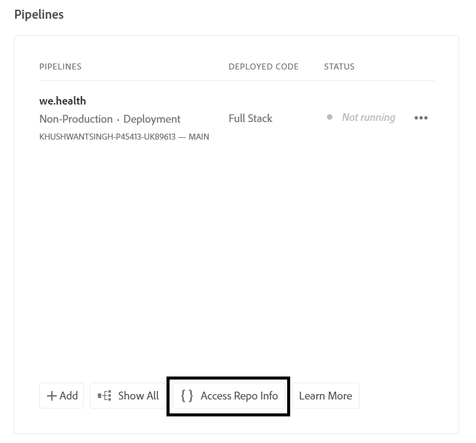

# Configurare l’ambiente di sviluppo per i moduli adattivi headless su Cloud Service

<span class="preview"> Questo articolo è un **LAVORO IN CORSO**.</span>


Sei pronto a creare e testare moduli adattivi headless su Cloud Service? Abilita Forms per il tuo programma Cloud Service e vai avanti.

## Prima di iniziare

* Installa la [versione più recente di Git](https://git-scm.com/downloads) nel computer locale. Se sei un nuovo utente di Git, vedi [Installazione di Git](https://git-scm.com/book/en/v2/Getting-Started-Installing-Git). L’archivio Git viene utilizzato per inviare all’ambiente di sviluppo Cloud Service i moduli e il codice personalizzato sviluppati nell’ambiente di sviluppo locale.

* Installa [Node.js 16.13.0 o versione successiva](https://nodejs.org/en/download/) nel computer locale. <!-- URL IS 404! If you are new to Node.js, see [How to install Node.js](https://nodejs.org/en/learn/how-to-install-nodejs). -->


* Creazione di un programma AEM as a Cloud Service: segui i passaggi 1-7 dell&#39;articolo [creazione di un programma](https://experienceleague.adobe.com/en/docs/experience-manager-cloud-service/content/onboarding/demo-add-on/create-program#create-program) per creare un programma per la tua organizzazione.

* Abilita il [canale prerelease per il tuo programma Cloud Service](https://experienceleague.adobe.com/en/docs/experience-manager-cloud-service/content/release-notes/prerelease#cloud-environments).

## Imposta flusso di lavoro

Per abilitare i moduli adattivi headless nella sandbox di Forms as a Cloud Service, abilita la soluzione `Forms - Digital enrolment` per il tuo programma AEM Cloud Service. Quindi, crea un progetto basato su Archetipo 37 o versione successiva sul computer locale e invialo all’ambiente Forms as a Cloud Service. Il processo completo è:


### &#x200B;1. Abilita Forms per il programma

<table style="table-layout:auto">
<tr>
  <td>
  1. Accedere a <a href="https://experience.adobe.com/" > https://experience.adobe.com/ </a> e selezionare l'opzione <b> Experience Manager </b>.
  </td>
  <td>
    <a href="https://experienceleague.adobe.com/en/docs/experience-manager-cloud-service/content/onboarding/demo-add-on/create-program#create-program">
      
    </a>
    <br>
  </td>
</tr>
<tr>
  <td>
  2. Per l'opzione <b> Cloud Manager </b>, fare clic su <b> Launch. </b> Viene visualizzato un elenco di programmi per l'organizzazione.
  </td>
  <td>
    <a href="https://experienceleague.adobe.com/en/docs/experience-manager-cloud-service/content/onboarding/demo-add-on/create-program#create-program">
      
    </a>
    <br>
  </td>
</tr>
<tr>
  <td>
    3. Per il programma, toccare l'icona ... e selezionare l'opzione <b> Modifica programma </b>. Viene visualizzata una finestra di dialogo. 
  </td>
  <td>
    <a href="https://experienceleague.adobe.com/en/docs/experience-manager-cloud-service/content/onboarding/demo-add-on/create-program#create-program">
      
    </a>
    <br>
  </td>
</tr>
<tr>
  <td>
    4. Nella finestra di dialogo Modifica programma passare alla scheda <b> soluzioni e componenti aggiuntivi </b>, selezionare l'opzione <b> Forms - Registrazione digitale </b> e toccare <b> aggiornamento </b>. 
  </td>
  <td>
    <a href="https://experienceleague.adobe.com/en/docs/experience-manager-cloud-service/content/onboarding/demo-add-on/create-program#create-program">
      
    </a>
    <br>
  </td>
</tr>
</table>

### &#x200B;2. Clonare l’archivio Git del programma sul computer locale

Ogni programma AEM as a Cloud Service ha un archivio Git. Consente di caricare codice personalizzato e risorse da un computer locale all’ambiente Cloud Service. Durante la configurazione, Adobe utilizza l’archivio Git per portare dal computer locale al programma Cloud Service codici, modelli e altre informazioni relative ai moduli adattivi headless. La clonazione dell’archivio Git di Cloud Service sul computer locale è il primo passo per portare codice personalizzato e contenuto dal computer locale a Cloud Service.

>[!INFO]
>
> È sempre possibile eseguire il commit in un archivio Git senza clonarlo. Ma ha le sue peculiarità. Questo documento userà quindi l&#39;approccio della clonazione.


Per clonare l’archivio:

<table style="table-layout:fixed">
<tr>
  <td>
  1. Nella casella pipeline del programma, tocca <b> Accedi a dati archivio. </b> Viene visualizzata una finestra di dialogo con le informazioni dell’archivio 
  </td>
  <td>
    <a href="https://experienceleague.adobe.com/en/docs/experience-manager-cloud-service/content/onboarding/demo-add-on/create-program#create-program">
      
    </a>
    <br>
  </td>
</tr>
<tr>
  <td>
  2. Tocca <b> per generare la password </b> e copiare l'URL dell'archivio <b>. </b> 
  </td>
  <td>
      
    <br>
  </td>
</tr>
<tr>
  <td>
    3. Nel computer locale aprire il prompt dei comandi, creare una cartella, eseguire il comando seguente e fornire le credenziali del repository, come richiesto:
    </br>
    <code> git clone [Repository URL] </code> </br></br>
    Ad esempio: </br> 
    <code> git clone https://git.cloudmanager.adobe.com/stage-aemformsdev/khushwantsingh-p45413-uk89613/ </code>

</br> Quando richiesto, ottenere il nome utente <b></b> e la <b>password</b> dalla schermata <b>Informazioni archivio</b>.
</td>
  <td>
     
  </td>
</tr>
</table>


### &#x200B;3. Creare un progetto basato su Archetipo AEM

Il progetto Archetipo è un modello basato su Maven. Crea un progetto minimo basato sulle best practice per iniziare a utilizzare i moduli adattivi headless. Include inoltre la funzionalità core Moduli adattivi headless per Forms as a Cloud Service. È obbligatorio creare e distribuire il progetto basato su Archetipo 37 o versione successiva.
®®®
A seconda del sistema operativo, esegui il comando maven per creare un progetto Experience Manager Forms as a Cloud Service. Utilizza la versione 37 o successiva di Archetipo. Per trovare la versione più recente di Archetipo, consulta la [documentazione di Archetipo](https://experienceleague.adobe.com/it/docs/experience-manager-core-components/using/developing/archetype/overview).

+++ Microsoft® Windows

1. Aprire il prompt dei comandi con privilegi amministrativi (eseguire il prompt dei comandi o la shell di base come amministratore).
1. Esegui il comando seguente:

   ```shell
     mvn -B org.apache.maven.plugins:maven-archetype-plugin:3.2.1:generate ^
     -D archetypeGroupId=com.adobe.aem ^
     -D archetypeArtifactId=aem-project-archetype ^
     -D archetypeVersion=37 ^
     -D appTitle=myheadlessform ^
     -D appId=myheadlessform ^
     -D groupId=com.myheadlessform ^
     -D includeFormsenrollment="y" ^
     -D includeFormsheadless="y" 
   ```

™™™

* Impostare `appTitle` per definire il titolo e i gruppi di componenti.
* Imposta `appId` per definire l&#39;ID dell&#39;artefatto Maven, i nomi delle cartelle di componenti, configurazione e contenuto e i nomi delle librerie client.
* Impostare `groupId` per definire l&#39;ID gruppo Maven e il pacchetto Java™ Source.
* Utilizza l&#39;opzione `includeFormsenrollment=y` per includere le configurazioni specifiche di Forms, i temi, i modelli, i Componenti core e le dipendenze necessari per creare Forms adattivo.
* Utilizza l&#39;opzione `includeFormsheadless=y` per includere i componenti core Forms e le dipendenze necessarie per includere la funzionalità dei moduli adattivi headless. Quando si abilita questa opzione, sono inclusi i seguenti elementi:
   * Modello **vuoto con componenti core** con [componenti core](https://experienceleague.adobe.com/it/docs/experience-manager-core-components/using/introduction).
   * Un modulo di React front-end, `ui.frontend.react.forms.af`. Ti aiuta a eseguire il rendering di un modulo adattivo headless in un’app react.

+++

<!-- Note to author: `&reg;&reg;&reg;` after `+++` prevents the accordion from working properly -->

+++ Apple macOS o Linux®

1. Apri il terminale come utente root. Consente di eseguire comandi con privilegi amministrativi. È inoltre possibile utilizzare il comando `sudo root` dopo aver aperto la finestra del terminale per eseguire comandi con privilegi amministrativi.
1. Esegui il comando seguente:

   ```shell
     mvn -B org.apache.maven.plugins:maven-archetype-plugin:3.2.1:generate \
     -D archetypeGroupId=com.adobe.aem \
     -D archetypeArtifactId=aem-project-archetype \
     -D archetypeVersion=37 \
     -D appTitle=myheadlessform \
     -D appId=myheadlessform \
     -D groupId=com.myheadlessform \
     -D includeFormsenrollment="y" \
     -D includeFormsheadless="y"  
   ```

™™™

* Impostare `appTitle` per definire il titolo e i gruppi di componenti.
* Impostare `appId` per definire l&#39;ID dell&#39;artefatto Maven, i nomi di componente, configurazione, cartella contenuto e libreria client.
* Impostare `groupId` per definire l&#39;ID gruppo Maven e il pacchetto Java™ Source.
* Utilizza l&#39;opzione `includeFormsenrollment=y` per includere le configurazioni specifiche di Forms, i temi, i modelli, i Componenti core e le dipendenze necessari per creare Forms adattivo.
* Utilizza l&#39;opzione `includeFormsheadless=y` per includere i componenti core Forms e le dipendenze necessarie per includere la funzionalità dei moduli adattivi headless. Quando si abilita questa opzione, sono inclusi i seguenti elementi:
   * Modello **vuoto con componenti core** con [componenti core](https://experienceleague.adobe.com/it/docs/experience-manager-core-components/using/introduction).
   * Un modulo di reazione front-end, `ui.frontend.react.forms.af`. Ti aiuta a eseguire il rendering di un modulo adattivo headless in un’app react.

+++

Al completamento del comando, viene creata una cartella di progetto con il nome specificato in `appID`. Se ad esempio si utilizza `appID` con il valore `myheadlessform`, verrà creata una cartella denominata `myheadlessform`. Contiene il progetto basato su Archetipo.

### &#x200B;4. Invio del progetto basato su Archetipo AEM all’ambiente Cloud Service

1. Sostituisci il contenuto dell’archivio Git con il contenuto su di un progetto basato su Archtype.

   >[!VIDEO](https://video.tv.adobe.com/v/3409809/)

1. Apri il prompt dei comandi, accedi alla cartella dell’archivio Git ed esegui i comandi seguenti nell’ordine elencato per caricare nell’ambiente Cloud Service il contenuto sostituito. Puoi anche utilizzare un editor visivo invece di utilizzare i comandi seguenti per inviare contenuti all’archivio Cloud Service.

   ```
      git add .
      git commit
      git push origin
   ```

### &#x200B;5. Eseguire una pipeline di compilazione per il programma


<table style="table-layout:auto">
<tr>
  <td>
  1. Accedere a <a href="https://experience.adobe.com/" > https://experience.adobe.com/ </a> e selezionare l'opzione <b> Experience Manager </b>.
  </td>
  <td>
    <a href="https://experienceleague.adobe.com/en/docs/experience-manager-cloud-service/content/onboarding/demo-add-on/create-program#create-program">
      
    </a>
    <br>
  </td>
</tr>
<tr>
  <td>
  2. Per l'opzione <b> Cloud Manager </b>, fare clic su <b> Launch. </b> Viene visualizzato un elenco di programmi per l'organizzazione. Apri il programma. 
  </td>
  <td>
    <a href="https://experienceleague.adobe.com/en/docs/experience-manager-cloud-service/content/onboarding/demo-add-on/create-program#create-program">
      
    </a>
    <br>
  </td>
</tr>
<tr>
  <td>
    3. Per la pipeline, tocca l’icona ... e seleziona l’opzione <b> Esegui </b>. Se viene richiesto di eseguire la pipeline, toccare <b> Esegui </b> e attendere che lo stato </b> della pipeline <b> cambi in <b> Completato </b>.  
  </td>
  <td>
    <a href="https://experienceleague.adobe.com/en/docs/experience-manager-cloud-service/content/onboarding/demo-add-on/create-program#create-program">
      
    </a>
    <br>
  </td>
</tr>
</table>

Ora l’ambiente è pronto per l’utilizzo di moduli adattivi headless. Ora puoi caricare una definizione JSON di un modulo nell’ambiente Cloud Service. Quindi, crea un modulo adattivo headless basato su di esso e utilizza [getForm](https://opensource.adobe.com/aem-forms-af-runtime/api/#tag/Get-Form-Definition/operation/getForm) e altre API rest per utilizzare il modulo adattivo headless nell&#39;applicazione o nel servizio.
